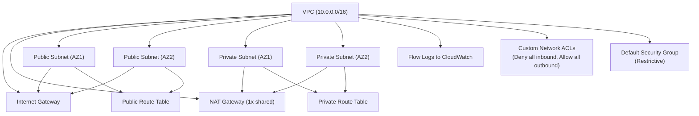

# Terraform AWS VPC Architecture

This diagram illustrates the VPC architecture created by the Terraform AWS VPC module.

## Diagram

## Resources Created

- VPC with CIDR range `10.0.0.0/16`
- Public and private subnets across multiple Availability Zones
- Internet Gateway for public subnets
- Shared NAT Gateway for private subnets
- Public and private route tables
- Flow Logs enabled to CloudWatch
- Custom Network ACLs:
  - Deny all inbound
  - Allow all outbound
- Default Security Group locked down
